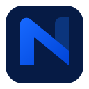

# Nitum PDF



**Nitum PDF** es un visor PDF nativo para Linux, macOS y Windows con firma
digital comprensible. Está construido íntegramente en Rust y Slint, sin Python
ni WebView en ejecución, pruebas o empaquetado.
Permite abrir, buscar, firmar y verificar documentos sin confundir la integridad
del archivo con la identidad del firmante.

Es el primer producto de la familia Nitum: herramientas de productividad claras,
confiables y sin complejidad innecesaria.

## Funciones

- Desplazamiento continuo, zoom, búsqueda, copia de página y selección
  rectangular de texto con resaltado y portapapeles nativo.
- Firma visible colocable con un clic —o invisible— mediante certificados
  `.p12`/`.pfx` y tokens PKCS#11.
- Bibliotecas para elegir y reutilizar varias identidades y firmas visuales
  guardadas. Las apariencias aceptan PNG, JPEG, GIF, BMP, TIFF y WebP, se
  normalizan de forma segura y siempre están respaldadas por el certificado.
- Flujo guiado para firmar o comprobar firmas recibidas.
- Firma PAdES B-B/B-T/B-LT/B-LTA, sellos RFC 3161, DSS con VRI y datos
  OCSP/CRL, y certificación DocMDP con permisos explícitos para cambios
  posteriores. Si la cadena o la revocación están incompletas, falla de forma
  segura en lugar de producir un nivel inferior con una etiqueta incorrecta.
- Firmas incrementales; nunca sobrescribe el documento original.
- Comprobación automática de nuevas versiones publicadas en GitHub.
- Descarga del paquete exacto para la plataforma, verificación SHA-256,
  instalación con autorización del sistema y reinicio recuperando el documento.
- Procedencia firmada de cada instalador mediante GitHub Artifact Attestations;
  Windows y macOS admiten además Authenticode y Developer ID/notarización.

### Identidades digitales compatibles

- **Archivos de Acrobat `.p12` y `.pfx`:** Nitum pide la contraseña, comprueba
  que exista una clave privada y muestra el nombre real del titular antes de firmar.
- **Tarjetas, DNI y tokens PKCS#11:** aparecen automáticamente cuando Linux y
  `p11-kit` reconocen el dispositivo; la firma solicita su PIN.
- **`.cer`, `.crt` y certificados `.pem`:** normalmente solo contienen la parte
  pública y no pueden firmar sin la clave privada. Nitum valida las firmas contra
  los almacenes de confianza del sistema.
- **Windows Certificate Store:** es una integración exclusiva de Windows. En
  Linux, el equivalente interoperable es exportar la identidad como `.pfx/.p12`.
- **Identidades remotas:** dependen del servidor y proveedor concreto; no son un
  formato de archivo que pueda importarse de manera genérica.

## Instalar

Descarga el `.deb`, `.pkg` o `.exe` más reciente desde
[GitHub Releases](https://github.com/dev-jackson/nitum-pdf/releases/latest) y ábrelo
con el instalador del sistema, o ejecuta:

En Debian/Ubuntu también puedes ejecutar `sudo apt install ./nitum-pdf-*.deb`.

Nitum PDF busca versiones nuevas al iniciarse. Nunca instala en silencio: primero
pide confirmación y después el sistema solicita autorización administrativa.
La procedencia de un instalador descargado también puede comprobarse con:

```bash
gh attestation verify nitum-pdf-<versión>-<plataforma>-<arquitectura>.<extensión> \
  --repo dev-jackson/nitum-pdf
```

## Ejecutar desde el código

```bash
cd native
./scripts/fetch-pdfium.sh debug
cargo run --locked -- ../documento.pdf
```

## Construir y probar

```bash
cd native
cargo fmt --all -- --check
cargo clippy --all-targets -- -D warnings
cargo test --all-targets --locked
cd ..
./packaging/native/build-linux-deb.sh 0.6.0
```

## Atajos

| Tecla | Acción |
|---|---|
| Ctrl+F o Ctrl+K | Buscar dentro del PDF |
| Ctrl+Mayús+S | Abrir el centro de firmas |
| Ctrl+O | Abrir otro PDF |
| Ctrl+C | Copiar el texto de la página |
| Ctrl+0 | Ajustar al ancho |
| Esc | Cancelar la colocación de firma |

Las decisiones de interfaz y sus referentes están documentados en
[DESIGN.md](DESIGN.md). Las mediciones reproducibles y el alcance de las pruebas
visuales están en [docs/QUALITY_REPORT.md](docs/QUALITY_REPORT.md).

## GitFlow y releases

El proyecto usa `main` para publicaciones y `develop` para integración. Consulta
[CONTRIBUTING.md](CONTRIBUTING.md) para crear `feature/*`, `release/*` y `hotfix/*`.
Cada etiqueta `vX.Y.Z` creada en `main` construye paquetes Linux x86_64/ARM64,
macOS Intel/Apple Silicon y Windows x86_64, sus SHA-256 y un GitHub Release.

## Privacidad y seguridad

Los documentos permanecen en el equipo. La actualización solo consulta la API
pública de GitHub. El paquete debe coincidir con el SHA-256 del release antes de
que Nitum PDF lo entregue al instalador autorizado del sistema.

Las identidades existentes de `pw-view-pdf` se conservan durante la migración.

## Licencia

MIT. Consulta [LICENSE](LICENSE).
